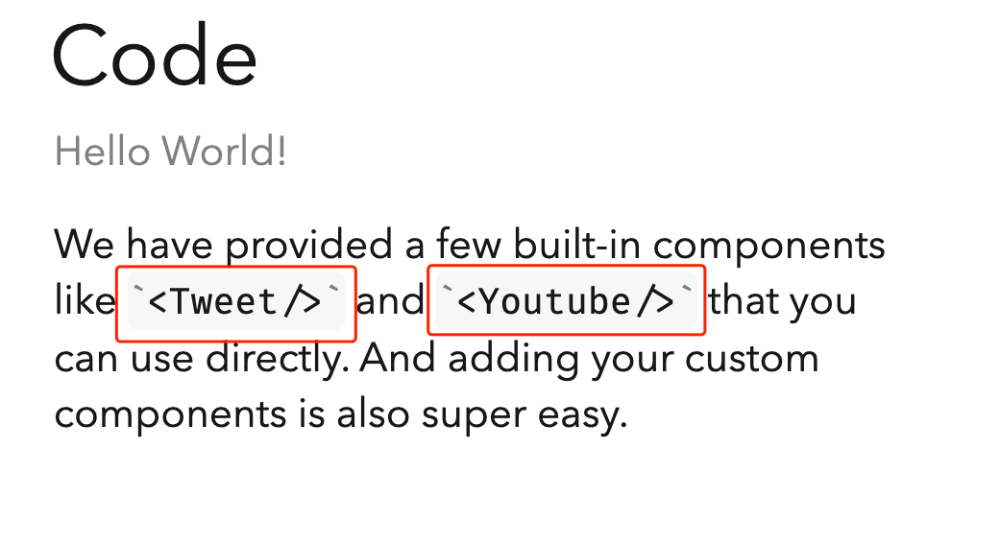

# slidev bugs report

## Environment

- slidev: 0.22.4
- yarn:   1.22.10

## Bugs reproduction

```bash
yarn dev
```

Screenshot goes as



where `<Tweet />` and `<Youtube />` render without hiding the backticks '\`'.
